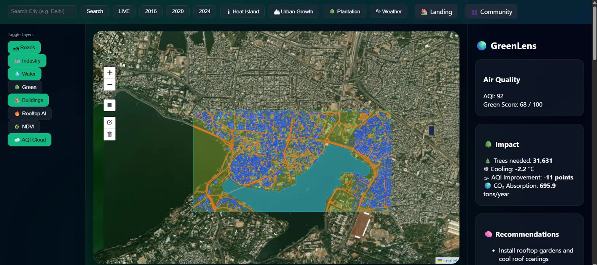
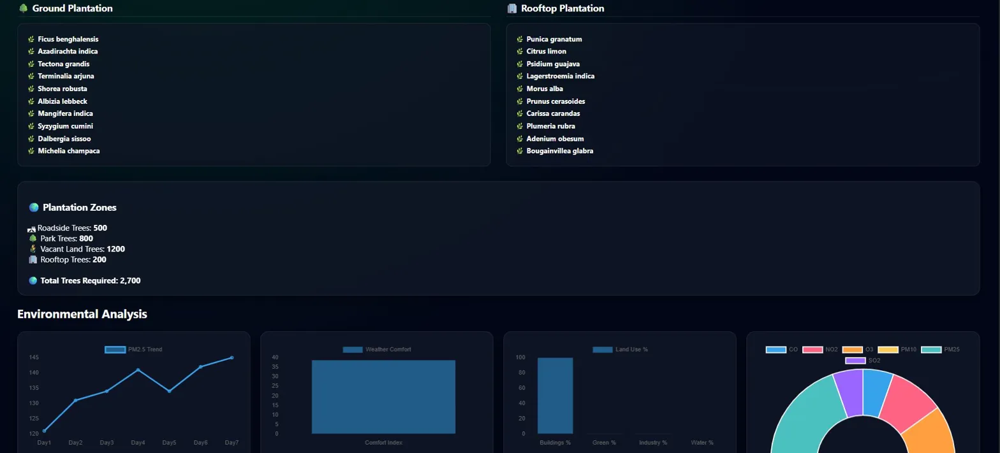
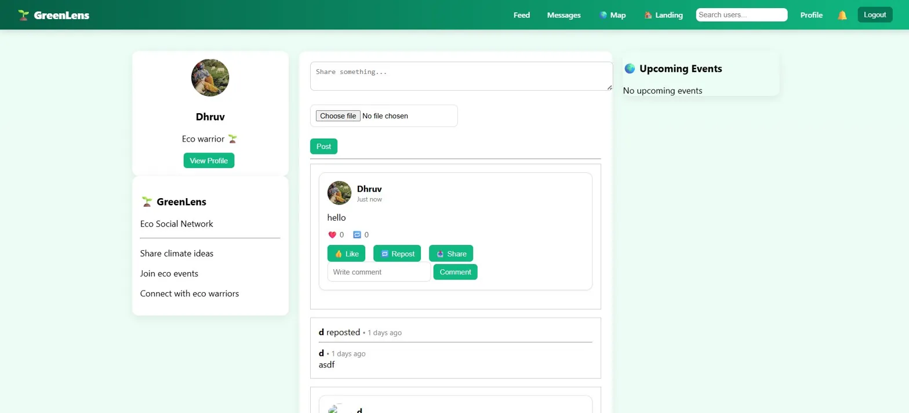

# 🌿 GreenLens — Environmental Intelligence Platform

> Analyze vegetation, pollution, and urban climate using satellite imagery, real-time AQI data, and AI-powered plantation recommendations.

---

## 🚀 Live Demo

**[https://greenlens-8eps.onrender.com](https://greenlens-8eps.onrender.com)**

---

## 📸 Screenshots

### 🛰️ Satellite Dashboard — OSM Layer Analysis


### 🌳 AI Plantation Report — Species & Environmental Analysis


### 🤝 Community Feed — Eco Social Network


---

## ✨ Features

### 🛰️ Satellite & Environmental Analysis
- **NDVI Vegetation Map** — Real-time vegetation health using Sentinel-2 imagery via Google Earth Engine
- **Thermal Heatmap** — Urban heat island detection using Landsat 8/9
- **Plantation Suitability Map** — Satellite-derived zones suitable for tree planting (NDVI + NDBI + NDWI)
- **Urban Expansion Tracker** — Built-up area growth from 2019 → 2024 → 2030 forecast

### 🌫️ Air Quality & Weather
- Live AQI from WAQI (World Air Quality Index) for any location
- 7-day AQI forecast with PM2.5 trend charts
- Weather data (temperature, humidity, wind) via OpenWeatherMap
- Pollution breakdown — PM2.5, PM10, NO2, O3, SO2, CO

### 🌳 AI Plantation Engine
- Species recommendations from GBIF biodiversity database (region-aware)
- Continent-based fallback tree database (Asia, Europe, Africa, Americas, Australia)
- Zone-specific plans — roadside, parks, rooftop gardens, vacant land
- Wikipedia + Wikidata species info with images
- Impact calculator — CO₂ absorption, expected cooling (°C), AQI improvement

### 🏙️ Urban Intelligence
- OSM-powered land use analysis — buildings, green areas, water bodies, industry
- Green Score (0–100) for any selected area
- Rooftop heat index for solar/cooling suitability
- Global city rankings — most polluted vs cleanest cities

### 🤝 Community Platform
- Social feed with posts, likes, comments, reposts
- Real-time messaging (inbox + chat)
- Connection/follow system with notifications
- Admin dashboard — event management, user management, content moderation
- Password strength validation + brute-force login protection

---

## 🛠️ Tech Stack

| Layer | Technology |
|-------|------------|
| Backend | Python, Flask, Flask-SQLAlchemy |
| Database | SQLite (via SQLAlchemy ORM) |
| Satellite Data | Google Earth Engine (Sentinel-2, Landsat 8/9) |
| Maps | Leaflet.js, OpenStreetMap, Overpass API |
| Air Quality | WAQI API |
| Weather | OpenWeatherMap API |
| Biodiversity | GBIF Species API |
| Geocoding | Nominatim (OSM), GeoDB Cities API |
| Auth | Session-based, bcrypt password hashing |
| Deployment | Gunicorn + Render |

---

## 📦 Setup & Installation

### 1. Clone the repository
```bash
git clone https://github.com/Dhruv-1710/greenlens.git
cd greenlens
```

### 2. Create a virtual environment
```bash
python -m venv venv
source venv/bin/activate      # Linux/Mac
venv\Scripts\activate         # Windows
```

### 3. Install dependencies
```bash
pip install -r requirements.txt
```

### 4. Configure environment variables (optional)
```bash
cp .env.example .env
# Open .env and fill in any API keys you have
```

**All keys are optional on localhost** — the app runs without any of them
using OSM data and built-in fallbacks. Add keys to unlock live data:
- **OpenWeatherMap key** — [openweathermap.org/api](https://openweathermap.org/api) *(live weather + better city search)*
- **WAQI token** — [aqicn.org/data-platform/token](https://aqicn.org/data-platform/token/) *(live AQI + station data)*
- **Google Earth Engine** — [earthengine.google.com](https://earthengine.google.com/) *(satellite NDVI/thermal/plantation tiles)*.
  On localhost just run `earthengine authenticate` once — no key file needed.
  Without GEE, the dashboard automatically renders OSM-based heatmaps instead.

### 5. Run the app
```bash
python app.py
```

Visit `http://localhost:5000`

---

## 🗂️ Project Structure

```
greenlens/
├── app.py                  # Flask backend — all routes and APIs
├── urban_cache.json        # Pre-cached urban expansion data
├── requirements.txt
├── .env.example            # Environment variable template
├── docs/                   # Screenshots for README
├── templates/
│   ├── landing.html        # Landing page
│   ├── dashboard.html      # Satellite analysis dashboard
│   ├── social.html         # Community feed
│   ├── profile.html        # User profile
│   ├── messages.html       # Direct messaging
│   ├── inbox.html          # Message inbox
│   ├── auth.html           # Login / Signup
│   └── admin.html          # Admin panel
└── static/
    └── uploads/            # User uploaded images
```

---

## 🌍 API Endpoints

| Endpoint | Description |
|----------|-------------|
| `GET /analyze` | Full environmental analysis for a bbox or lat/lon |
| `GET /ndvi` | NDVI vegetation tile from Sentinel-2 |
| `GET /heatmap` | Thermal heatmap tile from Landsat |
| `GET /plantation_map` | Satellite plantation suitability layer |
| `POST /plantation_ai_report` | AI species recommendation for a bbox |
| `GET /recommendations` | GIS-based environmental recommendations |
| `GET /impact` | Green impact calculator (trees, CO₂, cooling) |
| `GET /urban_growth` | Urban expansion data for a bbox |
| `GET /forecast` | Urban built-up area forecast to 2030 |
| `GET /environment_full` | AQI, weather, land use, pollution breakdown |
| `GET /city_aqi` | Live AQI + weather for lat/lon |
| `GET /global_rank` | Global city AQI rankings |
| `GET /species_info` | Tree species info from Wikipedia/GBIF |
| `GET /search` | City geocoding via OpenWeatherMap |

---

## 🔒 Security Notes

- All API keys loaded from environment variables (`.env`) — never hardcoded
- Session-based authentication with `httponly` cookies
- Password hashing with `pbkdf2:sha256` via Werkzeug
- Brute-force protection — 5 attempts → 15-minute lockout
- Admin-only routes verified server-side by role check

---

## 👤 Author

**Dhruv Yadav**
- GitHub: [github.com/Dhruv-1710](https://github.com/Dhruv-1710)
- LinkedIn: [linkedin.com/in/dhruv-yadav-95b1302ba](https://www.linkedin.com/in/dhruv-yadav-95b1302ba/)
- Email: dhruvyn3@gmail.com

---

## 📄 License

MIT License — feel free to use this project for learning and portfolio purposes.
